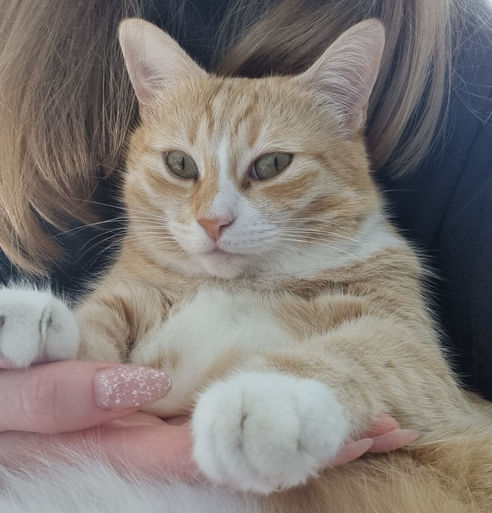

# Fine tuning Stable Diffusion
This project was created to generate images of my cat Masha using text-to-image model.

    

## Installation
pip install -r requirements.txt

## Dataset
To prepare train dataset for Stable Diffusion text-to-image model we need images and text description for each of them. Fortunately we can use [BLIP](https://huggingface.co/docs/transformers/model_doc/blip) model to generate descriptions automatically. 

In blip_labels_preparation.py I used start_string='a cat' to define a part of description I want to receive. But in final results I want a neural network that knows Masha by name, so all 'a cat' in generated strings replaced by replace_string='Masha'. In the end of preparation we got dataset which contains images and descriptions about Masha written to metadata.jsonl.

## Trainig
I copied training train_text_to_image.py script from [huggingface repository](https://github.com/huggingface/diffusers/tree/main/examples/text_to_image) and trained the model on 16GB GPU with parameters saved in start_train.sh.

## Results
Examples of generated images after train:

    

